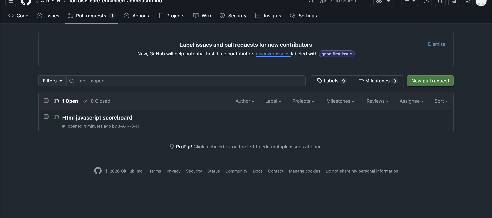
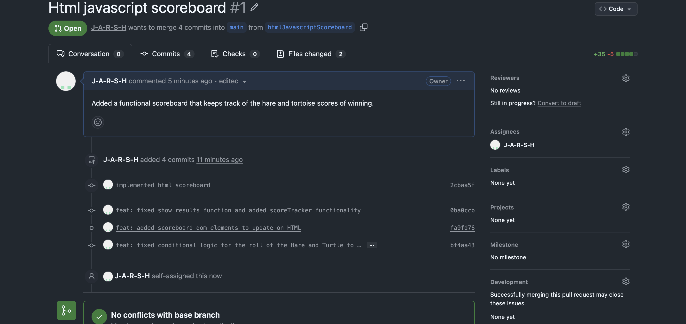

What feature did you implement?

I implemented option 1 of adding a scoreboard as it keeps track of the hare's and turtle's total wins.

What was the most difficult bug or issue?

I would say it was when I accidentally commited into the wrong branch and I had to figure out how to unstage my files.

Paste your 3 best commit messages.

There's 4:

- implemented html scoreboard
- feat: fixed show results function and added scoreTracker functionality
- feat: added scoreboard dom elements to update on HTML
- feat: fixed conditional logic for the roll of the Hare and Turtle to be more fair

Add a screenshot of your Pull Request page.

